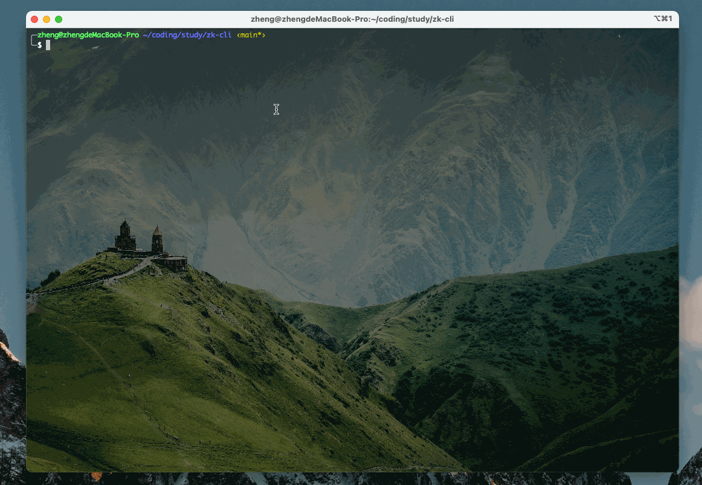

# zookeeper 终端可视化客户端


## `-h`
传入 zookeeper 服务地址，不传默认为 `127.0.0.1:2181`

## 快速开始
你可以克隆本仓库代码：
```shell
git clone https://github.com/greycodee/zk-cli.git
```
然后在项目根目录下编译本项目（需要有 Go 环境）
```shell
go build .
```

你也可以直接到[发布页面](https://github.com/greycodee/zk-cli/releases)下载对于系统的压缩包，解压后即可使用。


## 界面错乱解决办法

- windows
在 `cmd` 中执行命令：

```shell
chcp 65001
```

- mac or linux
终端执行命令：

```shell
export RUNEWIDTH_EASTASIAN=0
```
